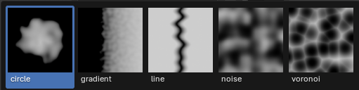

# Heightmap

Since Blender 4.2.0, all our addons are bundled as extensions, which is a wrapper for addons and themes. You can install them analog to normal addons.

In the following chapters we will go through the installation and setup, So you can use the addon properly

## Installation

after you purchased the product, you need to download the "... \_extension.zip" file, in order to install the extension, you need to use blender version 4.2.0+.

With Blender open. you can install the extension under edit -> preferences -> get extenstions -> install from dist (dropdown menu on the top right corner) -> select the downloaded \_extension.zip file.

## Setup

In order to use the addon properly, you need to add a catalog of heightmaps, which can then be added to your terrain.

A catalog is a directory containing following structure:

    Catalog
        Categorie 1
        Categorie 2
            Heightmap 1
            Heightmap 2
                heightmap.png
                preview.png
            ...
        ...

There is a premade catalog available with this product with an extensive range of different heightmaps, but you can also create your own catalog containing your custom heightmaps using this structure.

## Adding Terrain

## Using heightmaps

## Using Masks

You can add masks for the whole terrain or for a specific heightmap. The mask is a texture containing values from 0 - 1.

Here is a overview of the different masks:

Those masks can be used for

## Performence

## Texturing

## Scaling
