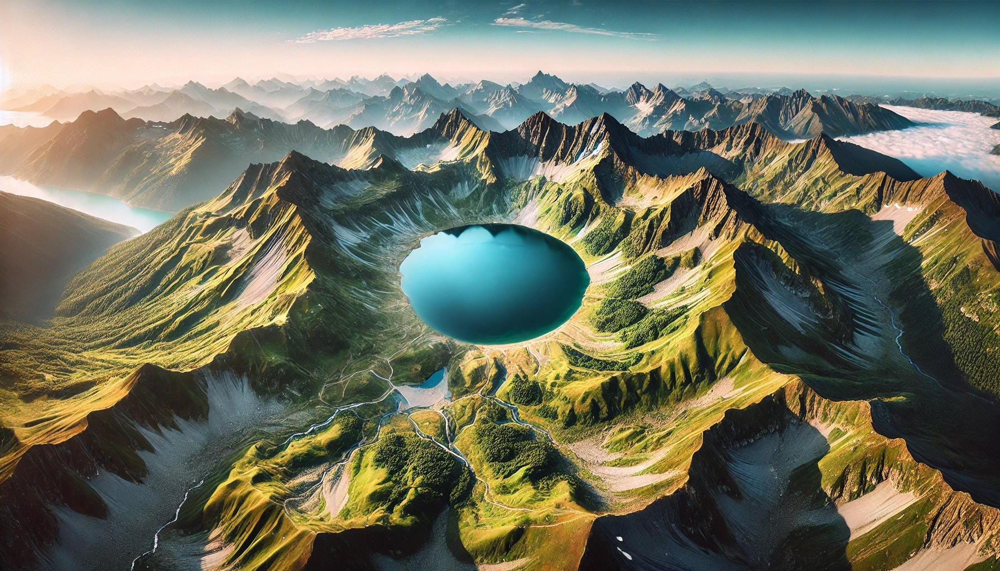
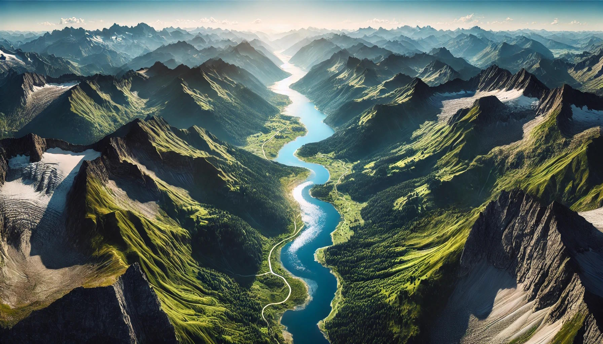

# Heightmap

The T. S. Heightmap addon is used for creating the terrain geometry and ground texture. In most cases this is the first part of the environment creation, because you can define the basic layout of your scene. The addon uses a non-distructive workflow, which means you can change / delete settings at any given state.

The addon comes with a wide range of premade heightmaps, which you can be stacked ontop of each other. This enables a very fast workflow, because the erosion and other properties are already contained by the heightmaps and dont need to be calculated. Furthermore Masks can be added for custom control of the heightmaps.

## Setup

In order to use the addon properly, you need to add a catalog of heightmaps, which can then be added to your terrain.

A catalog is a directory containing following structure:

    Catalog
        Categorie 1
        Categorie 2
            Heightmap 1
            Heightmap 2
                heightmap.png
                preview.png
            ...
        ...

There is a premade catalog available with this product, containing an extensive range of different heightmaps, but you can also create your own catalog containing your custom heightmaps using this structure.

After adding such catalog, you can see the heightmaps and categories listed in the preferences window.

## Adding Terrain

After installing and setup the addon properly, you should see the heightmap panel when pressing "n" in the 3d-viewport.

By clicking the "Add Terrain" button, a new terrain gets created, you can work with. You can create multiple terrains in one scene. With a terrain selected as terrain, you can now modify it.

## Edit Terrain

Under the "Edit Terrain" Section, you can manage the heightmaps and masks used by the terrain.

Notice that you need to enable the editmode by clicking the button, in order to be able to add / remove heightmaps

### Using heightmaps

You manage the heightmaps using the buttons on the right side of the list

When adding a heightmap, you can choose between a heightmap using the added catalogs or you can use a custom path to an heightmap

Catalog:

Custom Path:

After Adding multiple heightmaps, you can change its properties by selecting the heightmap.

### Using Masks

You can add masks for the whole terrain or for specific heightmaps. The mask is a texture containing values from 0 - 1, controlling the height (Intensity) of the heightmap.

Here is an overview of the different masks:

Those masks are especially helpful for terrains with rivers or lakes.

## Performence

When dealing with large scale terrains, it might effect the performence of you scene, because to many geometry is drawn.

For this reasen, the terrain uses an lod system, which loads lots of detail close to the active camera and then decreases in resolution further from the camera. This gives the viewer the illusion of a large high detail terrain.

Of course you can adjust the lod-depth (number of detail increading steps around the camera), and the subdivisions used in the viewport and rendered view.

## Texturing

The terrain uses a material, which can easily be adjusted using the "Shader" panel.

## Scaling

Very important to notice is that you cant scale the terrain like other object using the "s" shortcut, becauses this messes up the shader used by the material. this results in artifacs and other problems:

Instead you need to use the scaling property under the geometry section "geometry scale".

