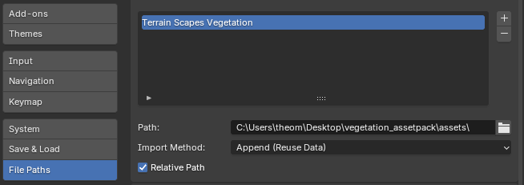
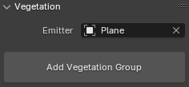
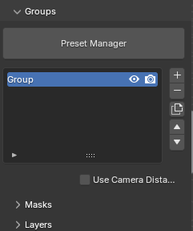
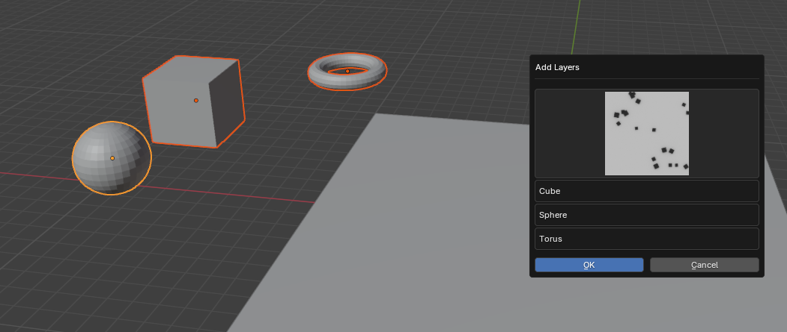
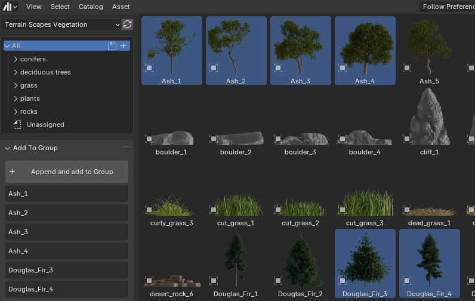
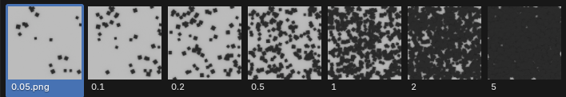
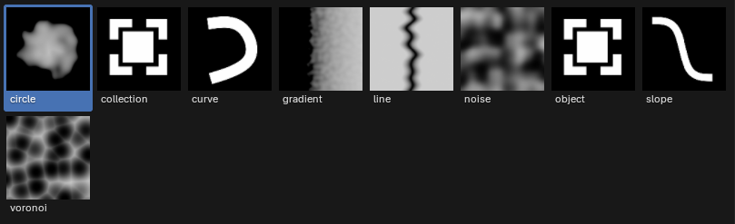
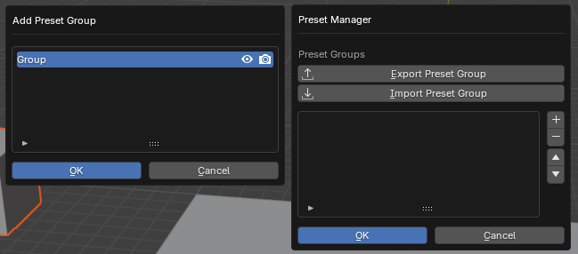

# Vegetation

After the structure of the terrain is defined, you can add trees, grass and vegetation. The T. S. Vegetation Addon is optimized for handling large amounts of instances, which makes the process of forest creation on large scale scenes very efficent.

The addon comes with a wide range of assets including trees, grass, and plants. Those assets can be accessed and scattered across the emitter directly from the asset browser. Other asset libraries can also be used using the asset browser.

## Setup

The addon comes with an asset-library of different vegetation assets. After you downloaded the "... \_asset_librarie.zip" file, you need to extract its content. With blender open under edit-> preferences -> file pahts -> add asset library -> choose the path to the extracted file.

After you completed this process, all assets can be easily appended using the "asset-browser" editor type. You can append an asset by dragging it from the asset browser to the 3d-viewport.

How you can scatter those assets directly on an vegetation system will be descriped in one of the following chapters.

## Choosing an emitter

Ater the installation and setup is complete. You can start by selecting an object as an emitter, which will then be used for the vegetation scattering. When a selected object not already uses the vegetation modifier, you need to click the "add vegetation" button so the vegetation system gets applied to the object.

## Groups

Each layer of scattered instances, belong to a group, which need to be added first. Those groups helps structuring the layers, which can be helpful when using lots of layers. It makes sense to use a group for each domain, for example: one group for large objects like trees, small objects like grass and stones, ... etc.

## Adding Layers

A layer contains the properties, which are used for scattering one object on the emitter. You can only add a layer to the selected group.

You can add layers using the main panel in the 3d-viewport, which will create a layer for each selected object.

Or you can use the panel in the asset-browser, which will create a layer of each selected asset.

before the layers gets added you can specify the density in which the object gets scattered.

## Using Masks

When using masks for a group, each scattering layer of this group gets effected by it. So if you want the mask only effect specific scattering layers, you need to use a own group for them.

There are plenty of different masks to use:

The most important ones for landscape creation are:

- Slope: For controlling at which steepness plants and trees still grow. it is much harder for vegetation to grow on very steep areas, so you might need to decrease the density for them there.

- Gradient: using the object position, you can create a transition, so the vegetation density decreases on higher altitudes.

Also important when trying to avoid colision with other objects:

- Object: Avoid scattered instances to overlap with an object.

- Collection: Avoid scattered instances to overlap with each object of an collection.

## Presets

If you want to use a group of layers for multiple scenes, you can save the group as a preset. Allowing you to quickly rebuild vegetation systems over and over again.

Notice that only layers, which uses assets of an asset-library, can be loaded in a different scene. Otherwise blender cant access the object which is needed.
